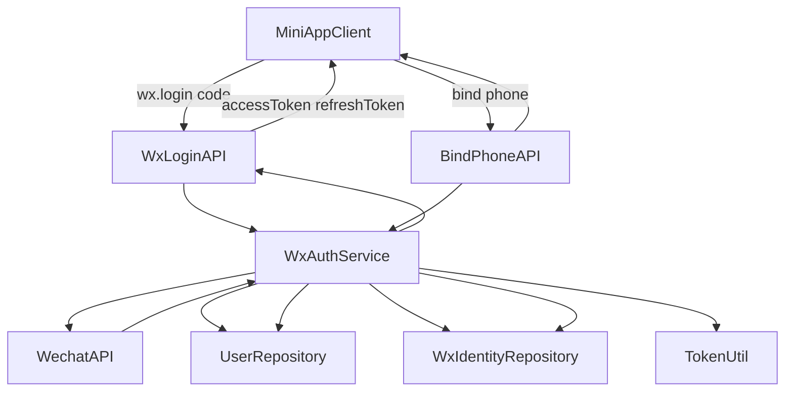

# 后端登录鉴权实施计划（复用现有 auth 模块）

## 目标与边界

- 在不推翻现有认证体系的前提下，新增“小程序微信登录 + 手机号绑定”闭环。
- 复用现有 JWT 鉴权链路（过滤器、Token 工具、SecurityUser），只补足小程序身份模型与接口。
- 保持与当前返回结构一致，减少前端改造成本。

## 现状基线（将复用）

- 认证配置：`[c:\Users\qi.yang\backend\src\main\java\com\ssc\llmop\backend\common\config\ShiroConfig.java](c:\Users\qi.yang\backend\src\main\java\com\ssc\llmop\backend\common\config\ShiroConfig.java)`
- 登录控制器：`[c:\Users\qi.yang\backend\src\main\java\com\ssc\llmop\backend\auth\controller\SysLoginController.java](c:\Users\qi.yang\backend\src\main\java\com\ssc\llmop\backend\auth\controller\SysLoginController.java)`
- 登录服务：`[c:\Users\qi.yang\backend\src\main\java\com\ssc\llmop\backend\auth\service\SysLoginService.java](c:\Users\qi.yang\backend\src\main\java\com\ssc\llmop\backend\auth\service\SysLoginService.java)`
- 用户实体：`[c:\Users\qi.yang\backend\src\main\java\com\ssc\llmop\backend\auth\entity\SysUser.java](c:\Users\qi.yang\backend\src\main\java\com\ssc\llmop\backend\auth\entity\SysUser.java)`
- 用户仓储：`[c:\Users\qi.yang\backend\src\main\java\com\ssc\llmop\backend\auth\repository\SysUserRepository.java](c:\Users\qi.yang\backend\src\main\java\com\ssc\llmop\backend\auth\repository\SysUserRepository.java)`
- Token 工具：`[c:\Users\qi.yang\backend\src\main\java\com\ssc\llmop\backend\common\utils\TokenUtil.java](c:\Users\qi.yang\backend\src\main\java\com\ssc\llmop\backend\common\utils\TokenUtil.java)`

## 数据模型与表设计

- 在 `auth` 域新增小程序身份映射实体（建议 `SysUserWx`，一对一或一对多关联 `SysUser`）。
- 字段建议：`id`、`userId`、`openid`、`unionId`、`sessionKeyHash`、`phone`、`bindPhoneAt`、`createdAt`、`updatedAt`。
- 约束建议：
  - `openid` 唯一索引（同一小程序唯一身份）；
  - `userId` 普通索引（快速回查用户）；
  - `phone` 可空索引（绑定后查询）。
- 结合项目现状（JPA `ddl-auto=update` + `scripts/sql`），同步提供一份可回放 SQL 脚本，便于测试/生产一致性。

## 分层实现方案

- Controller 层（在现有登录控制器扩展小程序路由）：
  - `POST /api/auth/wx/login`：入参 `code`，返回 `accessToken/refreshToken/userProfile/isPhoneBound`。
  - `POST /api/auth/wx/bind-phone`：入参（`code` 或解密参数，按微信能力与前端约定），完成手机号绑定。
  - `GET /api/auth/me`：返回当前登录态用户与绑定状态。
- Service 层：
  - 新增 `WxAuthService`（或在 `SysLoginService` 增加小程序方法），封装 code 换取 openid、用户创建/关联、token 签发。
  - 增加绑定手机号业务：幂等绑定、重复手机号冲突校验、绑定审计字段更新。
- Repository 层：
  - 新增 `SysUserWxRepository`，支持 `findByOpenid`、`findByUserId`、`existsByPhone` 等查询。
- DTO 层：
  - 增加小程序登录请求/响应 DTO，避免直接暴露实体字段。

## 鉴权与安全配置

- 将新增登录接口加入匿名白名单，绑定手机号与 `me` 接口保持 `authc`。
- 复用现有 JWT 过滤器，不新增第二套鉴权中间件。
- Token 载荷建议最小化：`userId` + 必要角色/租户信息，避免写入敏感微信字段。
- 手机号绑定接口增加幂等与频控钩子位（可先留 TODO，后续接 Redis 限流）。

## 小程序前端兼容约束（新增）

- Header 规范：小程序所有受保护请求统一携带 `Authorization: Bearer <token>`，并保持 `Bearer` 大小写规范。
- 字段契约：前端以 `token`、`refreshToken`、`expires`、`userInfo` 为主读取字段，避免命名不一致导致状态异常。
- 刷新策略：收到 401 后触发 `POST /sys/login/refresh`（body 带 `refreshToken`），刷新成功后重放原请求；刷新失败则清理本地登录态并跳登录页。
- 登录态存储：本地持久化至少包含 `token`、`refreshToken`、`expires`，应用启动时做有效期检查与静默恢复。
- 匿名与鉴权边界：登录相关接口走匿名白名单；`/api/auth/me` 与业务接口必须带 token。
- 域名要求：发布前将后端域名加入微信小程序 request 合法域名，开发期与生产期分别配置。

## 接口时序（小程序）

## 验收与测试

- 单元测试：
  - `openid` 首次登录自动建档；
  - 已存在 `openid` 重登复用账号；
  - 绑定手机号幂等与冲突分支。
- 接口测试：
  - 未登录访问 `me` 返回 401；
  - 登录成功后访问 `me` 返回用户信息；
  - token 过期后 refresh 生效（复用现有刷新逻辑）。
- 联调测试：
  - 小程序端 `wx.login -> /api/auth/wx/login -> 带 token 访问受保护接口` 全链路通过。
  - 小程序端 token 过期触发 refresh 后自动重试成功，页面无感恢复。
  - refresh 失效场景下自动回退登录页，且不会出现请求死循环。

## 小程序前端改造清单（新增）

- 请求层改造（`utils/request.js`）：
  - 请求前注入 `Authorization: Bearer <token>`；
  - 响应层统一处理 401，并串行化 refresh（避免并发重复刷新）；
  - 刷新成功后重放一次原请求，失败则统一登出回退。
- 登录状态模块：
  - 新增轻量 auth store（或 `utils/auth.js`），封装 token 读写、过期判断、清理逻辑；
  - 暴露 `isLoggedIn`、`getToken`、`saveSession`、`clearSession` 等方法给页面层。
- 页面流程：
  - 登录页：调用 `wx.login` 后请求后端登录接口；
  - 个人中心/设置页：根据 `isPhoneBound` 引导手机号绑定；
  - 应用启动：优先调用 `me` 校验会话可用性并同步用户状态。

## 风险与回退

- 微信接口异常（超时/限流）时，统一错误码并保留可观测日志。
- 若微信字段策略调整，仅影响 `WxAuthService` 与 `SysUserWx`，不破坏现有管理端登录。
- 数据变更采用“新增表/字段”策略，避免影响原有 `SysUser` 登录路径。

