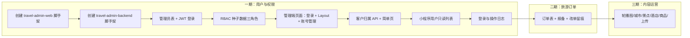
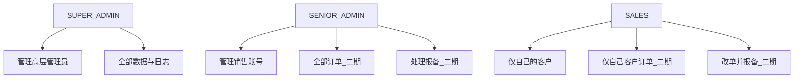

# 旅游后台一期规划

## 工程拆分（已确认）

在 [`/root/traveldemo`](/root/traveldemo) 根目录下**新建两个独立工程**，与现有小程序 [`travel-miniapp`](/root/traveldemo/travel-miniapp) 和既有 [`travel-backend`](/root/traveldemo/travel-backend) 并列，专门服务后台管理：

| 目录 | 用途 | 技术栈 |
|------|------|--------|
| `travel-admin-web/` | 后台管理前端（Web） | **React 18 + TypeScript + Vite + Arco Design Pro** |
| `travel-admin-backend/` | 后台管理后端 API | **Java + Spring Boot 3**（沿用现有后端技术栈） |

```text
traveldemo/
├── travel-miniapp/          # 现有：微信小程序（C 端）
├── travel-backend/          # 现有：小程序侧后端（可逐步复用公共能力）
├── travel-admin-web/        # 新建：管理后台前端
└── travel-admin-backend/    # 新建：管理后台后端
```

**说明：**

- 管理后台与小程序**分端、分鉴权**：管理员用账号密码登录后台；小程序用户仍走微信登录，两套 token 不混用。
- `travel-admin-backend` 可引用 `travel-backend` 中的公共模块（如统一响应体、工具类），但业务包独立，避免把管理端逻辑塞进小程序接口里。
- 一期开发范围：**先只做「用户及权限」**，旅游订单、内容运营按阶段接入。

---

## 技术选型（已确认）

### 管理后台前端：`travel-admin-web`

- **框架**：React 18 + TypeScript + Vite
- **UI**：[@arco-design/web-react](https://arco.design/react) + **Arco Design Pro** 布局（侧栏、顶栏、面包屑、表格、表单开箱即用）
- **路由**：React Router v6
- **请求**：axios + 统一拦截器（Bearer Token、401 跳转登录）
- **状态**：React Query（服务端状态）+ 轻量本地 store（登录态、菜单权限）
- **选型理由**：界面现代、默认观感好；Pro 模板集成度高，后续改菜单/表格/表单成本低

建议目录结构：

```text
travel-admin-web/
├── src/
│   ├── layouts/          # Pro Layout（侧栏 + 顶栏）
│   ├── pages/
│   │   ├── login/
│   │   ├── dashboard/
│   │   ├── system/       # 账号、角色、权限
│   │   └── user/         # 小程序用户管理（一期可只做列表+详情骨架）
│   ├── services/         # API 封装
│   ├── hooks/            # useAuth、usePermission
│   ├── routes/           # 路由 + 权限守卫
│   └── utils/
├── .env.development
└── package.json
```

### 管理后台后端：`travel-admin-backend`

- **框架**：Spring Boot 3 + Spring Security + JWT
- **持久化**：MyBatis-Plus 或 JPA（与 `travel-backend` 保持一致即可）
- **数据库**：与业务库同实例或独立 schema，表前缀建议 `admin_` 区分管理端实体
- **API 前缀**：建议 `/api/admin/v1/**`，与小程序 `/api/travel/**` 区分

建议包结构：

```text
travel-admin-backend/
└── src/main/java/com/travel/admin/
    ├── auth/           # 登录、刷新、当前用户
    ├── rbac/           # 角色、权限、管理员账号
    ├── user/           # 小程序用户查询（一期只读为主）
    ├── audit/          # 操作日志、登录日志
    └── common/         # 统一响应、异常、安全配置
```

---

## 一期目标范围（当前聚焦）

**本期只完成：用户及权限模块。**

包含：

1. 工程脚手架（前后端两个目录可启动、可联调）
2. 后台独立登录（超级管理员初始账号）
3. 三层角色 RBAC + 菜单/按钮权限
4. 管理员账号 CRUD（超级管理员管高层；高层管销售）
5. 销售-客户归属关系（表结构 + 基础 API，列表页可二期完善）
6. 操作日志 / 登录日志（关键操作留痕）
7. 小程序用户**列表 + 详情只读**（为后续积分/家庭组扩展预留入口，本期不强制做全量字段）

**本期不做（明确延后）：**

- 旅游订单全流程（列表、报备、改单）→ **二期**
- 轮播图 / 城市 / 景点 / 酒店 / 文创商品 CMS → **三期**
- 文创商品订单展示 → 不做

---

## 前端现状依据（小程序，供后续对照）

管理端业务字段仍需对齐小程序原型，当前线索来自：

- [前端首页原型](/root/traveldemo/travel-miniapp/src/app/App.tsx)：轮播图、热门城市、景点、酒店（三期 CMS）
- [用户中心原型](/root/traveldemo/travel-miniapp/src/app/components/Profile.tsx)：积分、收藏、订单、家庭档案
- [家庭档案原型](/root/traveldemo/travel-miniapp/src/app/components/FamilyProfile.tsx)：家庭成员独立表
- [用户 API 模型](/root/traveldemo/travel-miniapp/src/api/models/user.ts)：当前仅基础用户字段

---

## 角色与权限模型（已确认）

| 角色 | 代码建议 | 能力摘要 |
|------|----------|----------|
| 超级管理员 | `SUPER_ADMIN` | 仅你本人；最高权限；可创建/禁用高层管理员；可看全部数据与日志 |
| 高层管理员 | `SENIOR_ADMIN` | 查看全部；可改全部旅游订单（二期）；**可创建/管理普通销售**；处理销售报备；**不可**管理超级管理员 |
| 普通销售 | `SALES` | 仅看自己名下客户及其旅游订单；可有限改单但**必须报备留痕**（二期）；不可管理后台账号 |

### 订单相关规则（二期实现，此处定稿）

- 订单类型：**仅旅游服务/预约类订单**；不展示文创商品订单。
- 订单由**平台在后台录入/维护**，不是用户在前台下单文创的那套流程。
- 销售：可查看自己客户订单；修改需**向上级报备并自动记操作日志**。
- 高层：可查看并修改全部旅游订单。

### 权限实现方式

- **操作权限**：权限码，如 `admin:user:create`、`admin:role:assign`、`order:view_all`、`order:update_assigned`
- **数据权限**：销售只能访问 `sales_customer_binding` 中归属自己的 `app_user_id` 及其订单

---

## 一期后台菜单（管理端 `travel-admin-web`）

本期仅开放以下菜单：

### 1. 登录与个人中心

- 登录页（账号 + 密码）
- 当前管理员信息、修改密码、退出

### 2. 系统管理（本期核心）

- 管理员账号列表 / 新增 / 编辑 / 启用禁用
- 角色管理（固定三角色，可查看权限矩阵）
- 权限点列表（只读展示，一期用种子数据初始化）
- 销售账号管理（高层可见）
- 客户归属管理（销售 ↔ 小程序用户，一期可先 API + 简单列表）

### 3. 用户管理（本期轻量）

- 小程序用户列表（搜索：昵称、手机号）
- 用户详情（只读：基础信息；扩展字段占位：积分、爱好、家庭成员）

### 4. 审计（本期基础）

- 登录日志
- 操作日志（账号变更、角色分配、归属变更等）

**本期不开放菜单：** 旅游订单、内容运营、商品、上传资源库（路由可注释预留）。

---

## 一期数据实体

### 管理端账号与权限（本期必建）

| 表名 | 说明 |
|------|------|
| `admin_user` | 后台账号：用户名、密码哈希、姓名、手机、状态、最后登录 |
| `admin_role` | 角色：`SUPER_ADMIN` / `SENIOR_ADMIN` / `SALES` |
| `admin_user_role` | 用户-角色多对多 |
| `admin_permission` | 权限码 |
| `admin_role_permission` | 角色-权限 |
| `sales_customer_binding` | 销售 ID ↔ 小程序用户 ID，含分配人、分配时间 |
| `admin_login_log` | 登录日志 |
| `admin_operation_log` | 操作日志 |

### 小程序用户相关（一期只读 + 表可预建）

| 表名 | 本期 |
|------|------|
| `app_user` | 列表/详情只读（可与现有 user 表对齐或视图） |
| `user_profile_ext` | 可建表，页面二期编辑 |
| `user_family_member` | 可建表，页面二期 |
| `user_points_log` / `user_favorite` | 二期 |

### 旅游订单（二期）

`travel_order`、`travel_order_report`、`travel_order_modify_log` 等见下文「二期字段草案」，本期不建页面。

---

## 一期 API 清单（`travel-admin-backend`）

**认证**

- `POST /api/admin/v1/auth/login` — 管理员登录
- `POST /api/admin/v1/auth/refresh` — 刷新 Token
- `POST /api/admin/v1/auth/logout` — 退出
- `GET /api/admin/v1/auth/me` — 当前用户 + 角色 + 权限码列表

**系统 / RBAC**

- `GET/POST/PUT/PATCH /api/admin/v1/admins` — 管理员 CRUD（按角色限制谁能创建谁）
- `GET /api/admin/v1/roles` — 角色列表
- `GET /api/admin/v1/permissions` — 权限码列表
- `PUT /api/admin/v1/admins/{id}/roles` — 分配角色
- `GET/POST/DELETE /api/admin/v1/sales-bindings` — 销售-客户归属

**用户（只读）**

- `GET /api/admin/v1/app-users` — 分页列表
- `GET /api/admin/v1/app-users/{id}` — 详情

**审计**

- `GET /api/admin/v1/logs/login`
- `GET /api/admin/v1/logs/operation`

---

## 一期页面清单（`travel-admin-web`）

| 页面 | 角色可见 | 本期功能 |
|------|----------|----------|
| 登录 | 公开 | 表单登录、记住我（可选） |
| 工作台 | 已登录 | 简单欢迎 + 统计占位 |
| 管理员列表 | 超管、高层（受限） | 超管：全部；高层：仅销售账号 |
| 管理员表单 | 同上 | 新增/编辑/重置密码/启用禁用 |
| 角色与权限 | 超管 | 查看三角色权限矩阵 |
| 客户归属 | 超管、高层 | 为销售绑定/解绑客户 |
| 小程序用户列表 | 全部已登录角色 | 只读列表 |
| 小程序用户详情 | 全部 | 只读详情 |
| 登录/操作日志 | 超管、高层 | 分页查询 |

前端需实现：`PermissionGuard` 路由守卫 + 按钮级 `v-if` 权限（如 `usePermission('admin:user:create')`）。

---

## 实施顺序（开发任务）



1. **脚手架**：初始化 `travel-admin-web`、`travel-admin-backend`，本地联调通 `/auth/login`。
2. **认证与安全**：JWT、密码 BCrypt、Spring Security 白名单登录接口。
3. **RBAC 数据**：初始化三角色与权限码；种子超级管理员账号。
4. **管理端 UI**：Arco Pro Layout + 登录页 + 管理员 CRUD + 权限守卫。
5. **归属与审计**：销售-客户绑定、操作/登录日志。
6. **用户只读**：对接或复用 `app_user` 查询接口。

---

## 二期预留：旅游订单字段草案

`travel_order` 建议字段：订单编号、用户 ID、销售负责人 ID、目的地城市、行程类型、出行日期、人数、总金额、支付状态、订单状态、联系人、电话、特殊需求、时间戳。

`travel_order_report`：订单 ID、销售 ID、报备类型、内容、提交时间、上级处理状态与备注。

销售改单 → 自动写入 `travel_order_modify_log` + `travel_order_report`。

---

## 三期预留：内容运营

轮播图、热门城市、景点分类与详情、酒店合作、文创商品（含图、价、第三方跳转链接）、通用图片上传与资源库。对齐小程序 `TODO: [Backend Interface]` 位置。

---

## 权限架构图



---

## 本次交付边界

- 已写入：**双工程目录名、前后端技术栈、一期只做用户与权限、菜单与 API 清单、实施顺序**。
- 你确认本规划后，下一步可执行：**创建 `travel-admin-web` + `travel-admin-backend` 脚手架并实现登录与 RBAC**。
- 仍可在实现前微调：目录命名、数据库是否独立 schema、超级管理员初始账号创建方式（SQL 种子 vs 首次启动向导）。
